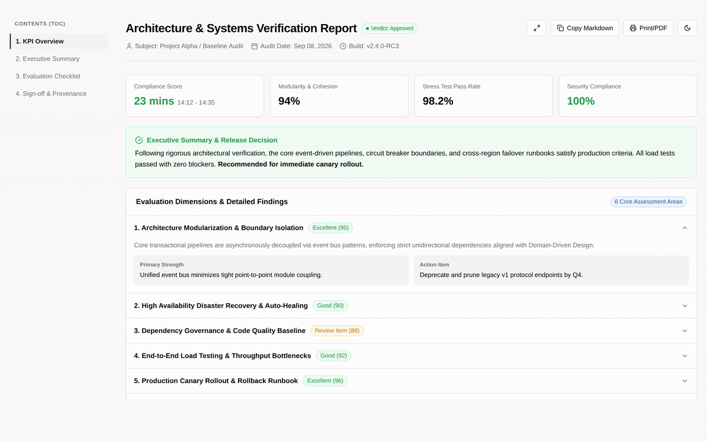
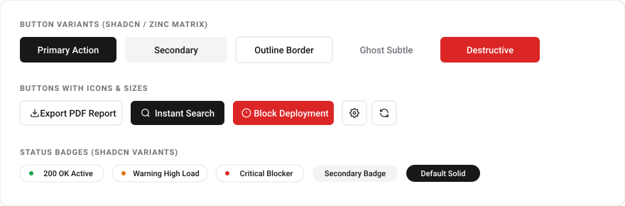
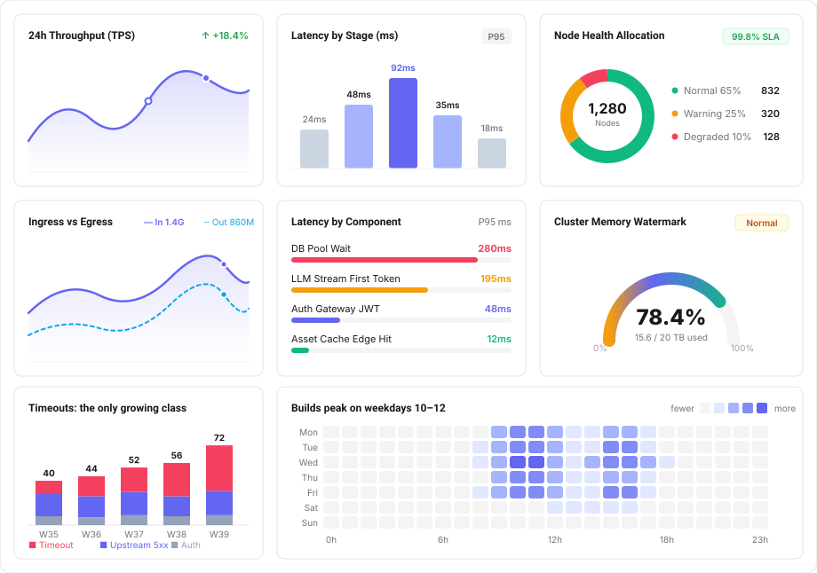
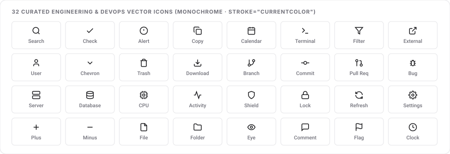

<div align="center">


# agent-html

<p>
  <strong>Zero-dependency, single-file HTML design system & agent skill for LLMs.</strong><br>
  Inspired by shadcn/ui. 100% offline. 0 npm packages. 0 external CDNs.<br>
  Optimized for Claude Code, Pi, Codex, and Cursor.
</p>

<p>
  <a href="README.md">English</a> ·
  <a href="README.zh-CN.md">简体中文</a>
</p>

<p>
  <a href="https://github.com/QingYunA/agent-html/releases"></a>
  <a href="https://skills.sh"></a>
  
  
  <a href="LICENSE"></a>
  <a href="https://github.com/QingYunA/agent-html/stargazers"></a>
</p>

<p>
  <a href="#installation--quick-start">Installation</a> ·
  <a href="#the-problem">The Problem</a> ·
  <a href="#what-you-get">What You Get</a> ·
  <a href="#the-6-archetypes">The 6 Archetypes</a> ·
  <a href="#atomic-capabilities--component-arsenal">Atomic Arsenal</a> ·
  <a href="#prompt-triggers">Prompt Triggers</a> ·
  <a href="#linter">Linter</a> ·
  <a href="#star-history">Star History</a>
</p>

</div>

---

<p align="center">
  
</p>

---

## Installation & Quick Start

### 1-Line Install via `skills` (Recommended)

Install directly into your coding agent (Claude Code, Cursor, Pi, Codex, Copilot, etc.) with zero manual cloning:

```bash
# Install to current project workspace
npx skills add QingYunA/agent-html

# Or install globally across all 70+ agents on your machine
npx skills add QingYunA/agent-html -g
```

### Try it Instantly (CLI)

No build step or Node.js server required. Explore the component gallery or scaffold a template immediately:

```bash
# Open the interactive component gallery in your browser
npx agent-html open

# Extract any raw archetype directly to a file
npx agent-html template dashboard > my-dashboard.html
npx agent-html template kanban > my-kanban.html
```

<details>
<summary><strong>Manual Git Symlink Setup (Alternative)</strong></summary>

```bash
git clone https://github.com/QingYunA/agent-html.git ~/Code/agent-html

# Link into universal agents directory
ln -sf ~/Code/agent-html/skills/agent-html ~/.agents/skills/agent-html

# If using Claude Code or Pi:
ln -sf ../../.agents/skills/agent-html ~/.claude/skills/agent-html
ln -sf ../../../.agents/skills/agent-html ~/.pi/agent/skills/agent-html
```
</details>

---

## The Problem

When asking LLMs (Claude Code, Pi, Codex, ChatGPT) to generate an HTML dashboard or report, the output usually falls into one of two traps:

- **The CDN trap:** The model injects `<script src="https://cdn.tailwindcss.com"></script>` and external Google Fonts. It looks acceptable at first glance, but breaks completely in air-gapped corporate intranets, takes 2 seconds to parse, causes flash-of-unstyled-content (FOUC), and rots over time when CDN endpoints change.
- **The visual slop trap:** If you forbid CDNs, the model hallucinates raw inline CSS with garish colors, harsh pure-black borders, random 30px paddings, broken alignment, and zero dark mode support.

`agent-html` fixes this by packaging a tight ~75-line native CSS token sheet and 4 battle-tested layout archetypes. Double-click any generated file in Finder, and it renders instantly with enterprise-grade polish.

---

## What You Get

- **Zero dependencies:** No `node_modules`, no npm build step, no CDN links. Every file runs offline and standalone.
- **Zinc-neutral design tokens:** A pure CSS variable port of shadcn/ui. 1px borders, subtle radii, clean typography, and high information density.
- **6 structural layout archetypes:** Scaffolds for Reports, Dashboards, Workbenches, Side-by-Side Comparisons, Timelines, and Kanban Boards ready to copy.
- **Native light & dark modes:** Seamless switching with CSS variables and a 5-line vanilla JS toggle.
- **Closed-loop feedback:** Built-in "Copy as Markdown" and "Copy Review Decisions" affordances so static HTML files never become dead ends.
- **Deterministic verification linter:** Includes `scripts/validate.mjs` so agents self-test tag symmetry, zero-CDN compliance, and viewport setup before presenting files to humans.
- **24 curated vector SVGs:** Lucide-style inline vector icons with `stroke="currentColor"` that adapt to font colors without font files.
- **Zero-CDN Pure SVG charts:** Area trend curves, column distributions, multi-segment donut ratio charts, and horizontal ranking bars.

---

## The 6 Archetypes

Rather than rigid business screens, `agent-html` provides 6 fundamental layout scaffolds with clear `<!-- [Slot: ...] -->` injection points:

<p align="center">
  
</p>

| Archetype | Template Path | Best For | Key Capabilities |
| :--- | :--- | :--- | :--- |
| **01. Document & Report** | [`templates/en/report.html`](templates/en/report.html) | Technical reviews, RFCs, audits | TOC ScrollSpy, KPI score overview, details accordion, print CSS |
| **02. Analytics Dashboard** | [`templates/en/dashboard.html`](templates/en/dashboard.html) | Metrics monitoring, billing | 4 KPI cards, native SVG area & bar charts, filterable table |
| **03. Master-Detail Workbench** | [`templates/en/inspector.html`](templates/en/inspector.html) | Trace inspection, prompt debugging | 100vh split screen, item filtering, JSON payload viewer, review actions |
| **04. Side-by-Side Comparison** | [`templates/en/compare.html`](templates/en/compare.html) | Model A/B testing, prompt diffs | Dual baseline vs challenger cards, delta comparison matrix |
| **05. Event Timeline** | [`templates/en/timeline.html`](templates/en/timeline.html) | Incident postmortems, changelogs | Single-track vertical timeline, status dots, diagnostic logs |
| **06. Triage Kanban** | [`templates/en/kanban.html`](templates/en/kanban.html) | Bug triage, backlog grooming | 4-column drag & drop, status badges, agent feedback loop |

<details>
<summary><strong>📸 Click to view full-resolution static screenshots for all 6 archetypes</strong></summary>
<br>

#### 01. Document & Executive Report
<p align="center"></p>

#### 02. Analytics Dashboard & Data Grid
<p align="center"></p>

#### 03. Master-Detail Workbench & Inspector
<p align="center"></p>

#### 04. Side-by-Side Comparison Matrix
<p align="center"></p>

#### 05. Event Timeline & Incident Postmortem
<p align="center"></p>

#### 06. Triage & Agile Kanban Board
<p align="center"></p>

</details>

---

## Atomic Capabilities & Component Arsenal

Beyond full-page archetypes, `agent-html` packages production-grade **atomic primitives** and **zero-CDN pure SVG charts**. 100% offline, zero npm, zero external CDN, and instant dark mode support:

### 1. Button System (Buttons Matrix)

<p align="center">
  
</p>

Semantic variants aligned with shadcn/ui standards, complete with `:hover`, `:active`, and `:disabled` micro-interactions:

| Variant | Class | Semantic Role | Common Use Case |
| :--- | :--- | :--- | :--- |
| **Primary** | `.btn.btn-primary` | Solid high-contrast block | Submit, approve, primary CTAs |
| **Secondary** | `.btn.btn-secondary` | Neutral subtle background | Cancel, back to list, secondary filters |
| **Outline** | `.btn.btn-outline` | 1px border stroke | Export report, copy Markdown, view details |
| **Ghost** | `.btn.btn-ghost` | Transparent, hover-only fill | Table row actions, breadcrumbs, link buttons |
| **Destructive**| `.btn.btn-destructive`| Semantic warning red | Block release, drop database, abort workflow |
| **With Icon** | `.btn` with inline `<svg>` | Icon + text pair | Download PDF, refresh status, search |
| **Icon Button** | `.btn.btn-icon` | 32x32px square | Theme toggle, settings, collapse trigger |

```html
<!-- Ready-to-copy button snippets -->
<button class="btn btn-primary">Approve Release</button>
<button class="btn btn-secondary">Previous Step</button>
<button class="btn btn-outline btn-sm">
  <svg width="13" height="13" viewBox="0 0 24 24" fill="none" stroke="currentColor" stroke-width="2"><path d="M21 15v4a2 2 0 0 1-2 2H5a2 2 0 0 1-2-2v-4"/><polyline points="7 10 12 15 17 10"/><line x1="12" y1="15" x2="12" y2="3"/></svg>
  <span>Export PDF</span>
</button>
<button class="btn btn-destructive btn-sm">Block Deployment</button>
```

---

### 2. Zero-CDN Pure SVG Charts

<p align="center">
  
</p>

Zero external JS chart libraries required. Uses standard inline SVG for crisp, Retina-sharp rendering that never breaks:

| Chart Type | Native Mechanism | Key Advantage | Typical Use Cases |
| :--- | :--- | :--- | :--- |
| **📈 Area Trend** | Bezier curves with `linearGradient` | Zero load time, smooth gradient | 24h throughput (TPS), latency trends |
| **📊 Column Histogram** | Rounded `rect` with data value labels | High contrast, intuitive comparison | P95/P99 latency distribution, error codes |
| **🍩 Multi-Segment Donut** | `circle` with `stroke-dasharray` offsets | Pure CSS variable math, zero JS | Node health ratio, resource allocations |
| **📉 Dual-Line Ingress/Egress**| Solid line vs dashed comparator line | Dual-metric temporal correlation | Inbound vs outbound traffic, baseline vs test |
| **📑 Horizontal Ranking Bar** | Pill progress bars with semantic colors | Maximum space efficiency | Slow query ranking, TTFT by model |
| **⏱️ Semi-Circle Gauge** | Semi-circle stroke arc with gradient | Immediate threshold alert | Memory watermark, API rate-limit quota |

<details>
<summary><strong>Expand to view sample SVG chart code snippets</strong></summary>

#### A. Gradient Area Trend Curve
```html
<svg viewBox="0 0 400 95" style="width: 100%; height: 85px; overflow: visible;">
  <defs>
    <linearGradient id="areaGrad" x1="0%" y1="0%" x2="0%" y2="100%">
      <stop offset="0%" stop-color="var(--chart-indigo)" stop-opacity="0.25"/>
      <stop offset="100%" stop-color="var(--chart-indigo)" stop-opacity="0.0"/>
    </linearGradient>
  </defs>
  <path d="M 0 70 Q 55 30, 110 52 T 210 36 T 310 18 T 400 28 L 400 95 L 0 95 Z" fill="url(#areaGrad)"/>
  <path d="M 0 70 Q 55 30, 110 52 T 210 36 T 310 18 T 400 28" fill="none" stroke="var(--chart-indigo)" stroke-width="2.5" stroke-linecap="round"/>
  <circle cx="210" cy="36" r="3" fill="var(--card)" stroke="var(--chart-indigo)" stroke-width="2"/>
  <circle cx="310" cy="18" r="3.5" fill="var(--chart-indigo)" stroke="var(--card)" stroke-width="2"/>
</svg>
```

#### B. Multi-Segment Donut Chart
```html
<svg viewBox="0 0 160 160" style="width: 120px; height: 120px;">
  <circle cx="80" cy="80" r="54" fill="none" stroke="var(--secondary)" stroke-width="18"/>
  <circle cx="80" cy="80" r="54" fill="none" stroke="var(--chart-emerald)" stroke-width="18" stroke-dasharray="220.5 339.3" stroke-dashoffset="0" transform="rotate(-90 80 80)"/>
  <circle cx="80" cy="80" r="54" fill="none" stroke="var(--chart-amber)" stroke-width="18" stroke-dasharray="84.8 339.3" stroke-dashoffset="-220.5" transform="rotate(-90 80 80)"/>
  <circle cx="80" cy="80" r="54" fill="none" stroke="var(--chart-rose)" stroke-width="18" stroke-dasharray="33.9 339.3" stroke-dashoffset="-305.3" transform="rotate(-90 80 80)"/>
  <text x="80" y="77" text-anchor="middle" font-size="16" font-weight="700" fill="var(--card-fg)">1,280</text>
  <text x="80" y="93" text-anchor="middle" font-size="9" fill="var(--muted-fg)">Nodes</text>
</svg>
```

</details>

---

### 3. 24 Curated Engineering Vector Icons

<p align="center">
  
</p>

Designed with `stroke="currentColor"` to automatically inherit font size and color in light and dark modes:

| Category | Curated Icons | Engineering Context |
| :--- | :--- | :--- |
| **System & Shell** | `Search` · `Terminal` · `Settings` · `Activity` | Global search, CLI output, settings, healthcheck |
| **DevOps & Git** | `Branch` · `Commit` · `PR` · `Bug` | Code reviews, trace audits, changelog releases |
| **Status & Verdicts** | `Check` · `Alert` · `Shield` · `Lock` | Pass badges, critical blockers, security audits |
| **Actions & Data** | `Copy` · `Download` · `Calendar` · `Filter` · `Refresh` | Copy back to Agent, PDF export, date ranges |
| **Infrastructure** | `Server` · `Database` · `CPU` · `External` | Host metrics, slow queries, cluster CPU, RFC docs |

```html
<!-- Automatic theme & color inheritance -->
<span style="display: inline-flex; align-items: center; gap: 6px; color: var(--ok);">
  <svg width="14" height="14" viewBox="0 0 24 24" fill="none" stroke="currentColor" stroke-width="2"><polyline points="20 6 9 17 4 12"/></svg>
  <span>All test suites passing</span>
</span>
```

---

## Prompt Triggers

Once installed, prompts like:
- *"Generate a standalone HTML dashboard for our cluster metrics with a trend chart"*
- *"Create an executive evaluation report for candidate John Doe as a single file"*
- *"Build a side-by-side prompt comparison matrix in HTML"*
- *"Don't write a wall of markdown, give me a clean single-file visual report for this PR review"*

will automatically trigger the `agent-html` skill and produce clean, zero-dependency, self-contained files.

---

## Atomic Components & Design Reference

All atomic HTML slots (buttons, badges, callouts, KPI stat cards), 24 currentColor vector SVGs, zero-CDN pure SVG charts, and vanilla interaction scripts are documented in [skills/agent-html/references/components.md](skills/agent-html/references/components.md) and live-previewed in `index.html`.

---

## Linter

Agents can self-verify their generated HTML before presenting it to the user:

```bash
# Validate a specific file
node scripts/validate.mjs path/to/output.html

# Validate all bundled templates
node scripts/validate.mjs --all
```

### Check Rules

- `[ZERO_CDN]`: Zero external CDN scripts or remote stylesheet links.
- `[THEME_TOKENS]`: Complete CSS token base (`--bg`, `--card`, `--border`, status colors) & dark mode support.
- `[VIEWPORT]`: Mobile responsive meta tag (`viewport`).
- `[TAG_HYGIENE]`: Symmetric tag closure (`<html>`, `<head>`, `<body>`).
- `[AFFORDANCE]`: Non-dead-end UI (export, copy, or print action present).
- `[COLOPHON]`: Timestamped generation metadata stamp in HTML comments.

---

## Repository Structure

```text
agent-html/
├── README.md                      # English documentation & showcase
├── README.zh-CN.md                # 简体中文文档
├── index.html                     # English landing page & component showcase
├── index.zh-CN.html               # 简体中文介绍主页与组件画廊
├── package.json                   # Project metadata & npm scripts
├── vercel.json                    # Vercel static deployment config (cleanUrls)
├── bin/
│   └── cli.mjs                    # Zero-dependency CLI runner (npx agent-html)
├── templates/                     # Standalone HTML templates
│   ├── en/                        # 🇺🇸 Pure English templates (6 archetypes)
│   └── zh/                        # 🇨🇳 Pure Chinese templates (6 archetypes)
├── assets/
│   ├── logo.svg                   # Vector brand logo (Gemini designed)
│   └── screenshots/
│       ├── en/                    # 🇺🇸 2x Retina screenshots for English docs
│       └── zh/                    # 🇨🇳 2x Retina screenshots for Chinese docs
├── scripts/
│   └── validate.mjs               # Zero-dependency deterministic HTML linter
└── skills/
    └── agent-html/
        ├── SKILL.md               # LLM prompt instructions & bilingual slot router
        ├── assets/                # Bundled templates & index mirror
        ├── references/
        │   └── components.md      # Atomic component & SVG reference catalog
        └── evals/
            └── evals.json         # Benchmark eval test cases (all 6 archetypes)
```

---

## Star History

<p align="center">
  <a href="https://star-history.com/#QingYunA/agent-html&Date">
    
  </a>
</p>

---

## Community

Join the discussion and share your feedback on [LINUX DO](https://linux.do).

---

## License

[MIT](LICENSE) © 2026 QingYunA

