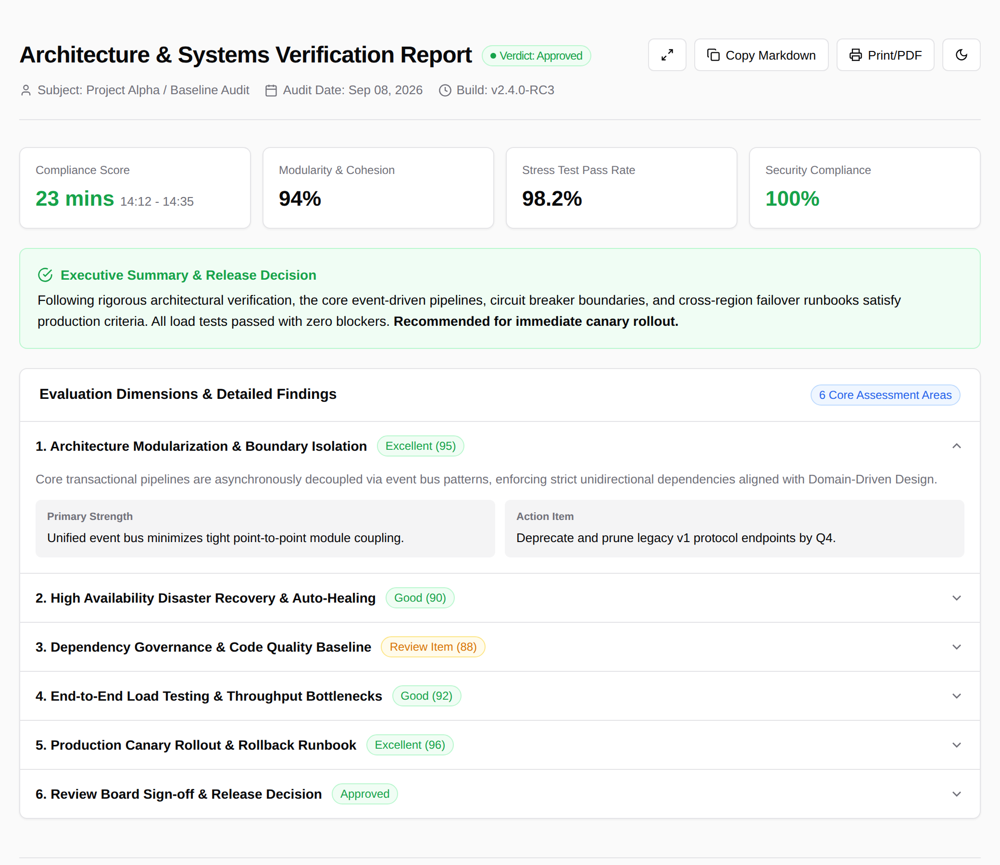
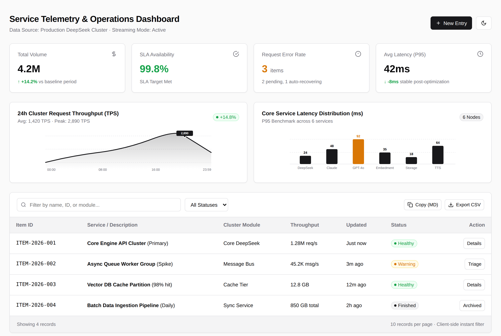
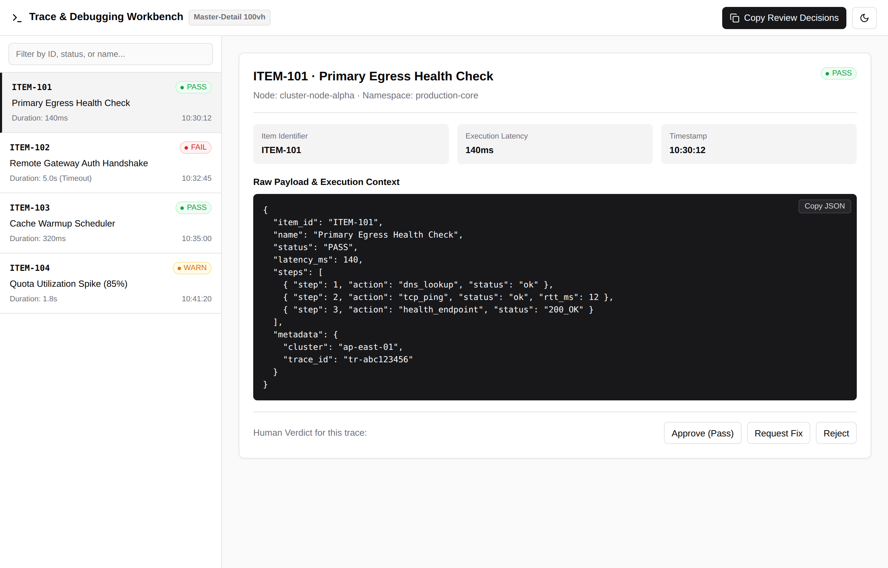
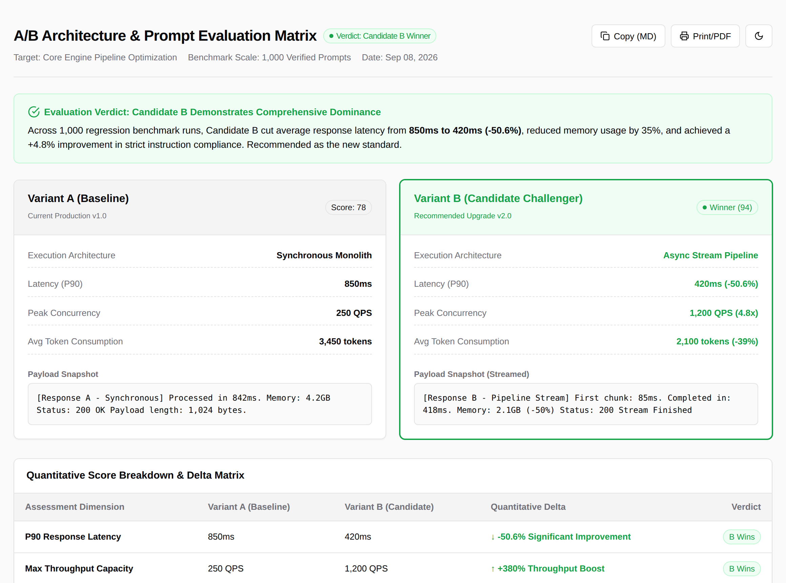
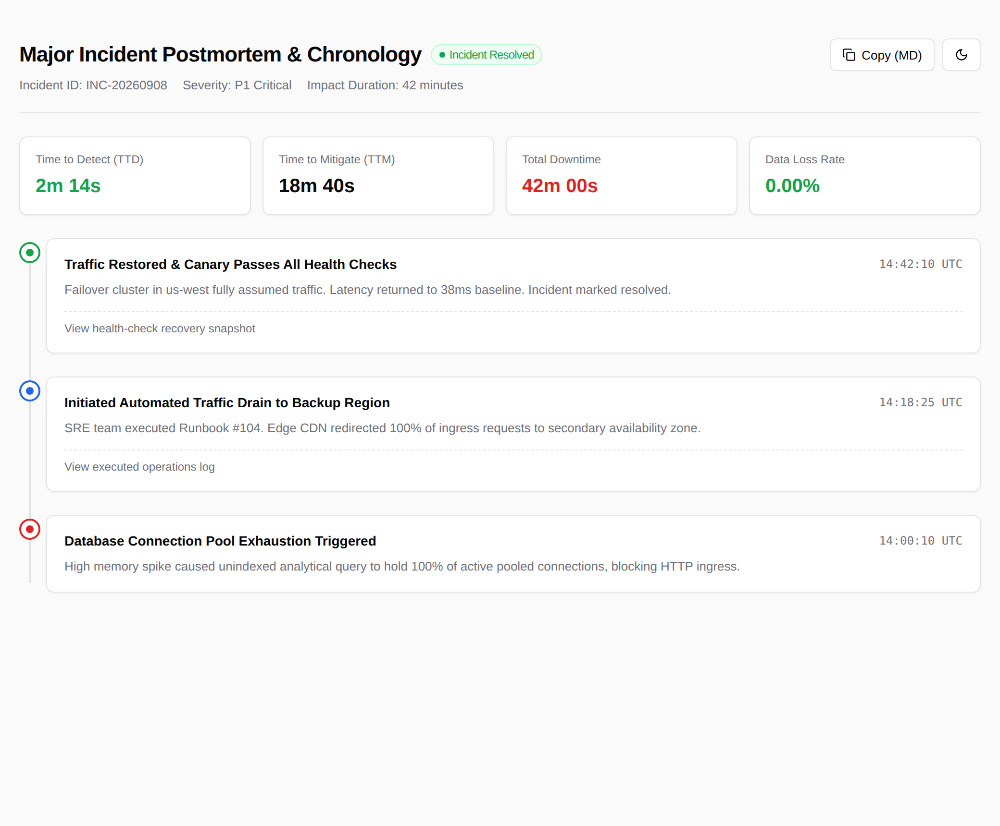
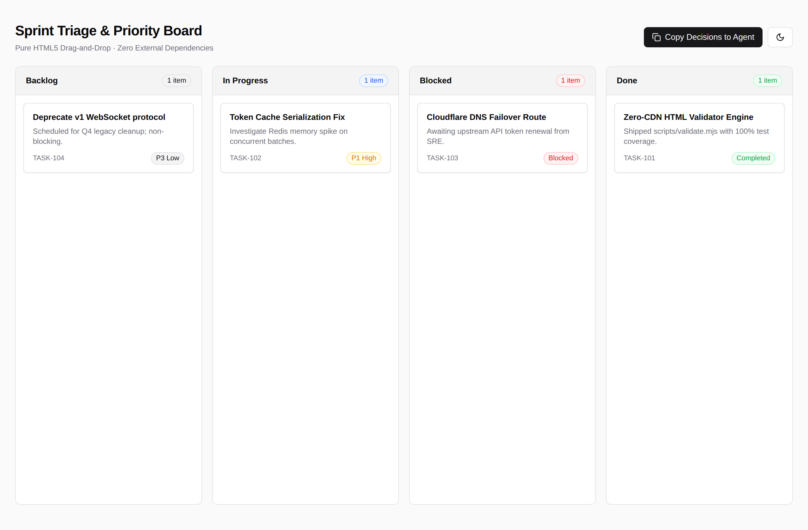

<div align="center">


# agent-html

<p>
  <strong>Zero-dependency, single-file HTML design system & agent skill for LLMs.</strong><br>
  Inspired by shadcn/ui. 100% offline. 0 npm packages. 0 external CDNs.<br>
  Optimized for Claude Code, Pi, Codex, and Cursor.
</p>

<p>
  <a href="README.md">English</a> ·
  <a href="README.zh-CN.md">简体中文</a>
</p>

<p>
  <a href="https://github.com/QingYunA/agent-html/releases"></a>
  <a href="https://skills.sh"></a>
  
  
  <a href="LICENSE"></a>
  <a href="https://github.com/QingYunA/agent-html/stargazers"></a>
</p>

<p>
  <a href="#installation--quick-start">Installation</a> ·
  <a href="#the-problem">The Problem</a> ·
  <a href="#what-you-get">What You Get</a> ·
  <a href="#the-6-archetypes">The 6 Archetypes</a> ·
  <a href="#prompt-triggers">Prompt Triggers</a> ·
  <a href="#linter">Linter</a> ·
  <a href="#star-history">Star History</a>
</p>

</div>

---

<p align="center">
  
</p>

---

## Installation & Quick Start

### 1-Line Install via `skills` (Recommended)

Install directly into your coding agent (Claude Code, Cursor, Pi, Codex, Copilot, etc.) with zero manual cloning:

```bash
# Install to current project workspace
npx skills add QingYunA/agent-html

# Or install globally across all 70+ agents on your machine
npx skills add QingYunA/agent-html -g
```

### Try it Instantly (CLI)

No build step or Node.js server required. Explore the component gallery or scaffold a template immediately:

```bash
# Open the interactive component gallery in your browser
npx agent-html open

# Extract any raw archetype directly to a file
npx agent-html template dashboard > my-dashboard.html
npx agent-html template kanban > my-kanban.html
```

<details>
<summary><strong>Manual Git Symlink Setup (Alternative)</strong></summary>

```bash
git clone https://github.com/QingYunA/agent-html.git ~/Code/agent-html

# Link into universal agents directory
ln -sf ~/Code/agent-html/skills/agent-html ~/.agents/skills/agent-html

# If using Claude Code or Pi:
ln -sf ../../.agents/skills/agent-html ~/.claude/skills/agent-html
ln -sf ../../../.agents/skills/agent-html ~/.pi/agent/skills/agent-html
```
</details>

---

## The Problem

When asking LLMs (Claude Code, Pi, Codex, ChatGPT) to generate an HTML dashboard or report, the output usually falls into one of two traps:

- **The CDN trap:** The model injects `<script src="https://cdn.tailwindcss.com"></script>` and external Google Fonts. It looks acceptable at first glance, but breaks completely in air-gapped corporate intranets, takes 2 seconds to parse, causes flash-of-unstyled-content (FOUC), and rots over time when CDN endpoints change.
- **The visual slop trap:** If you forbid CDNs, the model hallucinates raw inline CSS with garish colors, harsh pure-black borders, random 30px paddings, broken alignment, and zero dark mode support.

`agent-html` fixes this by packaging a tight ~75-line native CSS token sheet and 4 battle-tested layout archetypes. Double-click any generated file in Finder, and it renders instantly with enterprise-grade polish.

---

## What You Get

- **Zero dependencies:** No `node_modules`, no npm build step, no CDN links. Every file runs offline and standalone.
- **Zinc-neutral design tokens:** A pure CSS variable port of shadcn/ui. 1px borders, subtle radii, clean typography, and high information density.
- **6 structural layout archetypes:** Scaffolds for Reports, Dashboards, Workbenches, Side-by-Side Comparisons, Timelines, and Kanban Boards ready to copy.
- **Native light & dark modes:** Seamless switching with CSS variables and a 5-line vanilla JS toggle.
- **Closed-loop feedback:** Built-in "Copy as Markdown" and "Copy Review Decisions" affordances so static HTML files never become dead ends.
- **Deterministic verification linter:** Includes `scripts/validate.mjs` so agents self-test tag symmetry, zero-CDN compliance, and viewport setup before presenting files to humans.
- **24 curated vector SVGs:** Lucide-style inline vector icons with `stroke="currentColor"` that adapt to font colors without font files.
- **Zero-CDN Pure SVG charts:** Area trend curves, column distributions, multi-segment donut ratio charts, and horizontal ranking bars.

---

## The 6 Archetypes

Rather than rigid business screens, `agent-html` provides 6 fundamental layout scaffolds with clear `<!-- [Slot: ...] -->` injection points:

### Archetype 1: Document & Executive Report (`templates/report.html`)
Single-column centered layout (860px max-width) optimized for readability and print. Includes metadata header, status badges, KPI score overview, executive summary callout, native `<details>` accordions, one-click "Copy as Markdown" export, and `@media print` styles.

> **Use for**: Technical reviews, interview assessments, postmortems, architecture RFCs, and changelogs.

<p align="center">
  
</p>

---

### Archetype 2: Analytics Dashboard & Data Grid (`templates/dashboard.html`)
Fluid wide-screen layout with a 4-column KPI metric grid, responsive pure SVG charts (24h throughput area trend & P95 latency distribution bars with zero external libraries), dual-filter toolbar (real-time text search + status select), zebra hover table, and native `<dialog>` action modals.

> **Use for**: Resource usage monitoring, quota trackers, task lists, and operational dashboards.

<p align="center">
  
</p>

---

### Archetype 3: Master-Detail Workbench (`templates/inspector.html`)
Full-viewport app layout (`100vh` without outer page scroll). Left sidebar (320px) handles real-time item filtering, while the right detail pane dynamically renders selected metadata, property grids, human review verdict actions (Pass/Fix/Reject), and a "Copy Review Decisions back to Agent" button to close the interactive feedback loop.

> **Use for**: Trace replay, log inspectors, JSONL viewers, and prompt debuggers.

<p align="center">
  
</p>

---

### Archetype 4: Side-by-Side Comparison Matrix (`templates/compare.html`)
Two-column split view (Baseline vs. Challenger) with verdict callout, parameter specs, sample payload outputs, quantitative delta matrix table, and one-click "Copy as Markdown" export.

> **Use for**: LLM model evaluations (Model A vs. Model B), prompt revision benchmarks, and feature/pricing comparisons.

<p align="center">
  
</p>

---

### Archetype 5: Event Timeline & Incident Postmortem (`templates/timeline.html`)
High-density single-track vertical timeline with semantic status nodes (Error, Warning, Success, Info), exact timestamps, operator tags, expandable diagnosis logs, and one-click "Copy as Markdown" export.

> **Use for**: Incident postmortems, changelogs, release roadmaps, and event chronicles.

<p align="center">
  
</p>

---

### Archetype 6: Triage & Agile Kanban Board (`templates/kanban.html`)
Interactive 4-column categorization board (Backlog, Progress, Blocked, Done). Zero external dependencies, pure HTML5 drag-and-drop (~35 lines vanilla JS). Features a "Copy Triage Decisions to Agent" button to close the interactive loop.

> **Use for**: Ticket triage, task prioritization, backlog grooming, and bug tracking.

<p align="center">
  
</p>

---

## Prompt Triggers

Once installed, prompts like:
- *"Generate a standalone HTML dashboard for our cluster metrics with a trend chart"*
- *"Create an executive evaluation report for candidate John Doe as a single file"*
- *"Build a side-by-side prompt comparison matrix in HTML"*
- *"Don't write a wall of markdown, give me a clean single-file visual report for this PR review"*

will automatically trigger the `agent-html` skill and produce clean, zero-dependency, self-contained files.

---

## Atomic Components & Design Reference

All atomic HTML slots (buttons, badges, callouts, KPI stat cards), 24 currentColor vector SVGs, zero-CDN pure SVG charts, and vanilla interaction scripts are documented in [skills/agent-html/references/components.md](skills/agent-html/references/components.md) and live-previewed in `index.html`.

---

## Linter

Agents can self-verify their generated HTML before presenting it to the user:

```bash
# Validate a specific file
node scripts/validate.mjs path/to/output.html

# Validate all bundled templates
node scripts/validate.mjs --all
```

### Check Rules

- `[ZERO_CDN]`: Zero external CDN scripts or remote stylesheet links.
- `[THEME_TOKENS]`: Complete CSS token base (`--bg`, `--card`, `--border`, status colors) & dark mode support.
- `[VIEWPORT]`: Mobile responsive meta tag (`viewport`).
- `[TAG_HYGIENE]`: Symmetric tag closure (`<html>`, `<head>`, `<body>`).
- `[AFFORDANCE]`: Non-dead-end UI (export, copy, or print action present).
- `[COLOPHON]`: Timestamped generation metadata stamp in HTML comments.

---

## Repository Structure

```text
agent-html/
├── README.md                      # English documentation & showcase
├── README.zh-CN.md                # 简体中文文档
├── index.html                     # English landing page & component showcase
├── index.zh-CN.html               # 简体中文介绍主页与组件画廊
├── package.json                   # Project metadata & npm scripts
├── vercel.json                    # Vercel static deployment config (cleanUrls)
├── bin/
│   └── cli.mjs                    # Zero-dependency CLI runner (npx agent-html)
├── templates/                     # Standalone HTML templates
│   ├── en/                        # 🇺🇸 Pure English templates (6 archetypes)
│   └── zh/                        # 🇨🇳 Pure Chinese templates (6 archetypes)
├── assets/
│   ├── logo.svg                   # Vector brand logo (Gemini designed)
│   └── screenshots/
│       ├── en/                    # 🇺🇸 2x Retina screenshots for English docs
│       └── zh/                    # 🇨🇳 2x Retina screenshots for Chinese docs
├── scripts/
│   └── validate.mjs               # Zero-dependency deterministic HTML linter
└── skills/
    └── agent-html/
        ├── SKILL.md               # LLM prompt instructions & bilingual slot router
        ├── assets/                # Bundled templates & index mirror
        ├── references/
        │   └── components.md      # Atomic component & SVG reference catalog
        └── evals/
            └── evals.json         # Benchmark eval test cases (all 6 archetypes)
```

---

## Star History

<p align="center">
  <a href="https://star-history.com/#QingYunA/agent-html&Date">
    
  </a>
</p>

---

## Community

Join the discussion and share your feedback on [LINUX DO](https://linux.do).

---

## License

[MIT](LICENSE) © 2026 QingYunA

