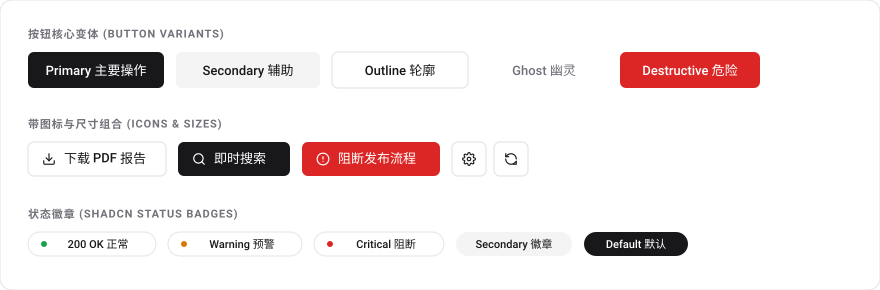
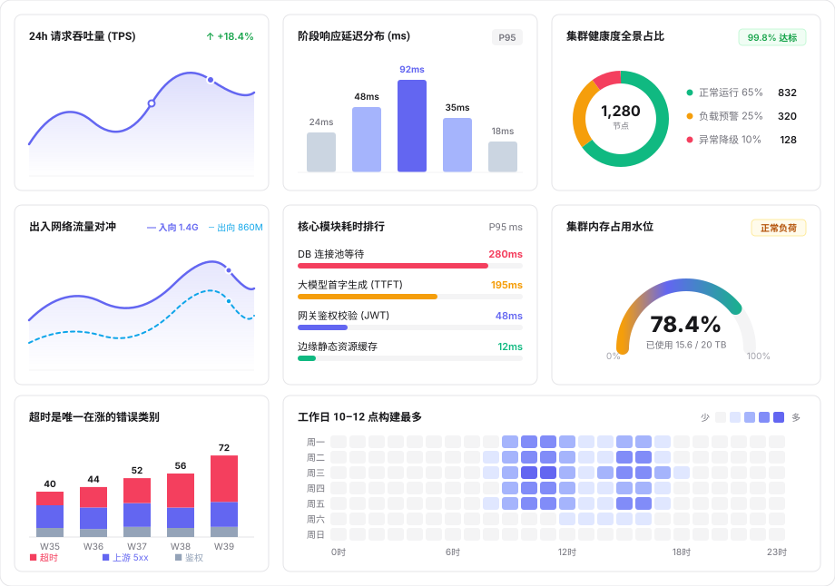
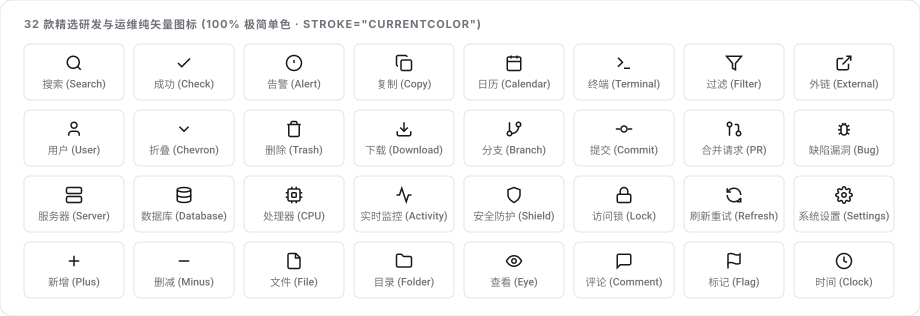

<div align="center">


# agent-html

<p>
  <strong>专为 AI Agent 打造的零依赖单文件 HTML 设计系统与组件库</strong><br>
  复刻 shadcn/ui 极简风格 · 100% 离线可用 · 0 npm 依赖 · 0 外部 CDN<br>
  已适配 Claude Code、Pi、Codex、Cursor 等主流工具
</p>

<p>
  <a href="README.md">English</a> ·
  <a href="README.zh-CN.md">简体中文</a>
</p>

<p>
  <a href="https://agent-html-bice.vercel.app" target="_blank"><strong>🌐 在线交互式画廊 Live Demo ↗</strong></a>
</p>

<p>
  <a href="https://agent-html-bice.vercel.app" target="_blank"></a>
  <a href="https://github.com/QingYunA/agent-html/releases"></a>
  <a href="https://skills.sh"></a>
  
  
  <a href="LICENSE"></a>
  <a href="https://github.com/QingYunA/agent-html/stargazers"></a>
</p>

<p>
  <a href="#快速安装与上手">快速安装</a> ·
  <a href="#解决什么痛点">痛点</a> ·
  <a href="#核心优势">核心优势</a> ·
  <a href="#六大真实场景模板">六大模板</a> ·
  <a href="#常用基础组件">基础组件</a> ·
  <a href="#提示词示例">提示词</a> ·
  <a href="#star-history">Star History</a>
</p>

</div>

---

<p align="center">
  <a href="https://agent-html-bice.vercel.app" target="_blank">
    
  </a>
  <br>
  <sub>👉 点击上方图片或访问 <a href="https://agent-html-bice.vercel.app" target="_blank"><strong>agent-html-bice.vercel.app</strong></a> 体验在线交互式组件画廊与母版预览</sub>
</p>

---

## 快速安装与上手

### 1. 使用 `skills` 一行命令安装（推荐）

无需手动克隆或配置路径，通过标准 CLI 一键安装至当前项目或全局 70+ 款 Coding Agent：

```bash
# 安装至当前项目工作区（Claude Code, Cursor, Copilot 等）
npx skills add QingYunA/agent-html

# 或全局安装至本机所有 70+ 款 Coding Agent（Claude Code, Pi, Cursor, Codex 等）
npx skills add QingYunA/agent-html -g
```

### 2. 免安装 CLI 体验

无需安装，直接在浏览器打开组件库，或者直接导出模板代码（也可以直接看在线 Demo：[**agent-html-bice.vercel.app**](https://agent-html-bice.vercel.app)）：

```bash
# 在浏览器打开中文组件库
npx agent-html open --zh

# 快速获取常用原子组件代码（直接复制用，不用自己手写）
npx agent-html snippet button
npx agent-html snippet metric-card

# 快速导出常用的场景模板
npx agent-html template dashboard > api-dashboard.html
npx agent-html template report > incident-report.html
npx agent-html template kanban > my-kanban.html
```

<details>
<summary><strong>手动 Git 软链安装（备选）</strong></summary>

```bash
git clone https://github.com/QingYunA/agent-html.git ~/Code/agent-html

# 链接至统一规范目录
ln -sf ~/Code/agent-html/skills/agent-html ~/.agents/skills/agent-html

# 为 Claude Code 或 Pi 建立感知软链
ln -sf ../../.agents/skills/agent-html ~/.claude/skills/agent-html
ln -sf ../../../.agents/skills/agent-html ~/.pi/agent/skills/agent-html
```
</details>

---

## 解决什么痛点？

让大模型（Claude Code, Pi, Codex, Cursor）写 HTML 页面时，基本都会遇到这两个问题：

- **依赖外部 CDN**：模型动不动就加上 `<script src="https://cdn.tailwindcss.com"></script>` 和 Google 字体。在公司内网或者没网的环境下直接白屏打不开，而且第一次打开加载慢、页面还会闪烁，时间一长 CDN 失效文件就废了。
- **手写样式不好看**：如果不准它用 CDN，模型就会自己手写内嵌 CSS——生成粗糙的黑边框、奇怪的间距、刺眼的高饱和度颜色，而且基本都不支持暗色模式。

`agent-html` 就是为了解决这个问题：整理了一套 70 多行的基础 CSS 变量，加上 6 套贴合真实开发场景的开箱即用模板。生成的 HTML 单文件双击就能秒开，干净好看，完全离线可用。

---

## 核心优势

- **真正零依赖**：不需要装 npm 包，不需要打包构建，不加载任何外部 CDN。双击 HTML 文件直接秒开，离线也能用。
- **干净耐看的设计**：参考 shadcn/ui 的设计风格。微细边框、舒适圆角、统一的中性灰调。
- **6 套贴合真实场景的模板**：复盘报告、API 成本看板、工作台审查、模型对比、故障时间线、Bug 看板。
- **原生暗色模式**：自动跟随系统切换深浅色，自带纯原生 JS 切换按钮。
- **方便把结果复制回终端**：页面里带有一键复制 Markdown 和结论的功能，方便直接贴回终端给 Agent 继续处理。
- **内置离线自检脚本（`scripts/validate.mjs`）**：在交给用户前，自动检查标签闭合、是否有外部 CDN 依赖和移动端视口配置。
- **24 个纯 SVG 图标**：不用图标库字体，图标颜色自动跟随文字，断网不丢图标。
- **纯 SVG 图表**：不需要引入任何图表库，用纯 SVG 绘制折线走势图、柱状图、环形图。

---

## 六大真实场景模板

告别虚构的演示数据，`agent-html` 提供 6 套真实工程师高频使用的场景模板，每套都带有清晰的结构注释：

<p align="center">
  
</p>

| 模板 | 文件路径 | 真实业务场景 | 包含的关键功能 |
| :--- | :--- | :--- | :--- |
| **Report 报告** | [`templates/zh/report.html`](templates/zh/report.html) | 线上事故复盘报告 (P0 Postmortem)、技术 RFC | 目录滚动高亮、结论打分卡、折叠详情、打印优化 |
| **Dashboard 数据面板** | [`templates/zh/dashboard.html`](templates/zh/dashboard.html) | API 消耗与成本看板、Token 用量分析 | 4 列指标卡、原生 SVG 趋势图/柱状图、带搜索的过滤表格 |
| **Inspector 审查工作台** | [`templates/zh/inspector.html`](templates/zh/inspector.html) | Agent 运行日志审查、Tool Payload 调试 | 左右分栏、左侧筛选日志、右侧查看详情、人工审批按钮组 |
| **Compare 对比** | [`templates/zh/compare.html`](templates/zh/compare.html) | DeepSeek vs GPT-4o 选型对比、Prompt 效果评估 | 左右方案对照、胜出结论提示框、量化指标差异表 |
| **Timeline 时间线** | [`templates/zh/timeline.html`](templates/zh/timeline.html) | 服务恢复时间线、版本发布日志 | 垂直时间轴、状态标记、日志折叠、一键复制 Markdown |
| **Kanban 看板** | [`templates/zh/kanban.html`](templates/zh/kanban.html) | Bug 分拣与需求看板、任务排期 | 原生拖拽卡片、任务优先级标签、复制看板状态回终端 |

<details>
<summary><strong>📸 点击展开查看全部 6 大模板大图</strong></summary>
<br>

#### 01. Report 报告
<p align="center"></p>

#### 02. Dashboard 数据面板
<p align="center"></p>

#### 03. Inspector 审查工作台
<p align="center"></p>

#### 04. Compare 对比
<p align="center"></p>

#### 05. Timeline 时间线
<p align="center"></p>

#### 06. Kanban 看板
<p align="center"></p>

</details>

---

## 常用基础组件

除了完整的页面模板，`agent-html` 还整理了常用的**基础组件**与**纯原生 SVG 图表**，方便直接拿去拼装。同样 100% 离线自包含、零外部依赖、自动支持深浅色主题：

### 1. 按钮组件 (Buttons)

<p align="center">
  
</p>

和 shadcn/ui 保持一致的命名与尺寸规范，自带悬浮、点击与禁用态：

| 类型 | 类名 | 视觉样式 | 常见用途 |
| :--- | :--- | :--- | :--- |
| **主要按钮 (Primary)** | `.btn.btn-primary` | 高对比黑白底色 | 提交表单、保存设置、确认执行 |
| **次要按钮 (Secondary)** | `.btn.btn-secondary` | 低饱和灰色底色 | 取消操作、返回上一页、二级筛选 |
| **边框按钮 (Outline)** | `.btn.btn-outline` | 1px 浅灰细边框 | 导出报表、复制内容、查看详情 |
| **幽灵按钮 (Ghost)** | `.btn.btn-ghost` | 平时不显示边框与底色，悬浮时高亮 | 表格行内操作、面包屑、文字链接 |
| **危险按钮 (Destructive)**| `.btn.btn-destructive`| 醒目的警示红色 | 删除数据、终止任务、下线服务 |
| **带图标按钮** | `.btn` 内嵌 `<svg>` | 图标加文字排版 | 下载文件、刷新页面、搜索内容 |
| **正方形图标按钮** | `.btn.btn-icon` | 32x32px 正方形小按钮 | 切换暗色模式、系统设置、展开折叠 |

```html
<!-- 常用按钮代码（直接复制使用） -->
<button class="btn btn-primary">确认发布</button>
<button class="btn btn-secondary">返回上一步</button>
<button class="btn btn-outline btn-sm">
  <svg width="13" height="13" viewBox="0 0 24 24" fill="none" stroke="currentColor" stroke-width="2"><path d="M21 15v4a2 2 0 0 1-2 2H5a2 2 0 0 1-2-2v-4"/><polyline points="7 10 12 15 17 10"/><line x1="12" y1="15" x2="12" y2="3"/></svg>
  <span>下载 PDF 报告</span>
</button>
<button class="btn btn-destructive btn-sm">终止任务</button>
```

---

### 2. 纯 SVG 原生图表 (Pure SVG Charts)

<p align="center">
  
</p>

不需要引入 ECharts 或 Chart.js 这类几百 KB 的外部脚本，用几十行纯 SVG 就能画出清晰耐看、高清不模糊的数据图表：

| 图表类型 | 绘制方式 | 特点 | 常见用途 |
| :--- | :--- | :--- | :--- |
| **📈 面积走势图 (Area Trend)** | `path` 曲线 + 渐变填充 | 加载极快，过渡自然 | API 请求量、耗时趋势分析 |
| **📊 耗时分布柱状图 (Histogram)** | `rect` 圆角矩形 + 顶部数值 | 直观对比高低数值 | P95/P99 耗时分布、错误码分布 |
| **🍩 环形占比图 (Donut Chart)** | `circle` 配合虚线偏移 | 不需要写 JS，纯样式控制 | 节点健康状态、资源分类占比 |
| **📉 双线对比图 (Dual-Line)** | 实线与虚线对照 | 同步对比两个维度的趋势 | 上行 vs 下行流量、优化前 vs 优化后对比 |
| **📑 耗时排行榜 (Ranking Bar)** | 胶囊进度条 + 数值条 | 节省空间，清晰直观 | 慢接口排行、微服务首字延迟 (TTFT) |
| **⏱️ 水位仪表盘 (Capacity Gauge)** | 半圆弧行程切割 + 警戒色 | 直观展示使用百分比 | 内存/显存水位、API 调用限额 |

<details>
<summary><strong>SVG 图表代码在哪里？</strong></summary>

六种图表形态的完整、正本代码只在一个地方：**[`skills/agent-html/references/components.md`](skills/agent-html/references/components.md) 第 6 节**。

这里**故意不再复制一份**。同一段代码存两份手抄副本迟早会漂移，而 README 里一份陈旧的副本比没有更糟——Agent 抄了它就会画出坏的图。（这个坑我们踩过，见 `skills/agent-html/references/failures.md` **F-014**。）

那边的每张图都带**四件套**：结论式标题、写明单位契约的副标题（`1 rim 点 = 300 TPS`）、图体、全大写编码说明行。契约条文在 [`SKILL.md`](skills/agent-html/SKILL.md)。

</details>

---

### 3. 24 个纯矢量 SVG 图标 (Vector Icons)

<p align="center">
  
</p>

使用 `stroke="currentColor"`，图标颜色自动跟随文字颜色，断网或离线环境下也不会丢图标：

| 分类 | 图标名称 | 常见用途 |
| :--- | :--- | :--- |
| **系统与搜索** | `Search (搜索)` · `Terminal (终端)` · `Settings (设置)` · `Activity (监控心跳)` | 全文搜索、命令行输出、系统配置、服务心跳 |
| **代码与协作** | `Branch (分支)` · `Commit (提交)` · `PR (合并请求)` · `Bug (缺陷)` | Git 变更记录、Trace 日志排查、版本更新 |
| **状态与判定** | `Check (成功)` · `Alert (告警)` · `Shield (安全)` · `Lock (锁定)` | 验收通过状态、告警提示、安全与权限控制 |
| **数据与操作** | `Copy (复制)` · `Download (下载)` · `Calendar (日历)` · `Filter (筛选)` · `Refresh (刷新)` | 复制结论给 Agent、导出文件、时间范围筛选 |
| **基础设置** | `Server (服务器)` · `Database (数据库)` · `CPU (处理器)` · `External (外链)` | 节点监控、慢 SQL 排查、集群负载、参考链接 |

```html
<!-- 使用方法：直接嵌入 HTML，图标颜色跟随文字 -->
<span style="display: inline-flex; align-items: center; gap: 6px; color: var(--ok);">
  <svg width="14" height="14" viewBox="0 0 24 24" fill="none" stroke="currentColor" stroke-width="2"><polyline points="20 6 9 17 4 12"/></svg>
  <span>全部测试通过</span>
</span>
```

---

## 提示词示例

安装后，平时你可以直接这样对你的 AI 助手说：
- *“做个单文件的 HTML 监控面板，展示接口延迟和请求量趋势图”*
- *“生成一份事故复盘报告的 HTML，支持目录高亮和打印”*
- *“帮我做一个 DeepSeek 和 GPT-4o 的对比页面”*
- *“把这段 Agent 的运行日志整理成左右分栏的审查页面”*

---

## 组件字典与设计规范参考

所有原子 HTML 插槽（按钮、胶囊徽章、Callout 提示条、KPI 统计卡）、24 个 currentColor 矢量 SVG 图标、零 CDN 原生 SVG 图表和微交互脚本，均完整收录在 [skills/agent-html/references/components.md](skills/agent-html/references/components.md) 中，并可在 `index.zh-CN.html` 中实时预览。

---

## Star History

<p align="center">
  <a href="https://star-history.com/#qingyuna/agent-html&Date">
    <picture>
      <source media="(prefers-color-scheme: dark)" srcset="https://api.star-history.com/svg?repos=qingyuna/agent-html&type=Date&theme=dark" />
      <source media="(prefers-color-scheme: light)" srcset="https://api.star-history.com/svg?repos=qingyuna/agent-html&type=Date" />
      
    </picture>
  </a>
</p>

---

## 社区交流

欢迎在 [LINUX DO](https://linux.do) 社区参与交流、反馈建议与分享使用体验。

---

## 开源协议

[MIT License](LICENSE) © 2026 QingYunA

