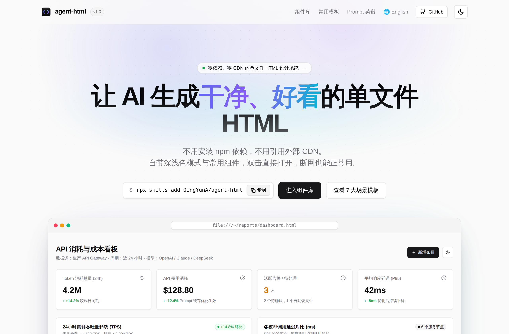
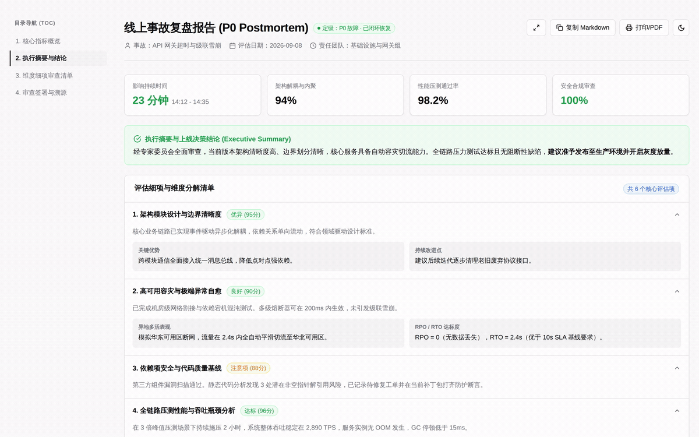
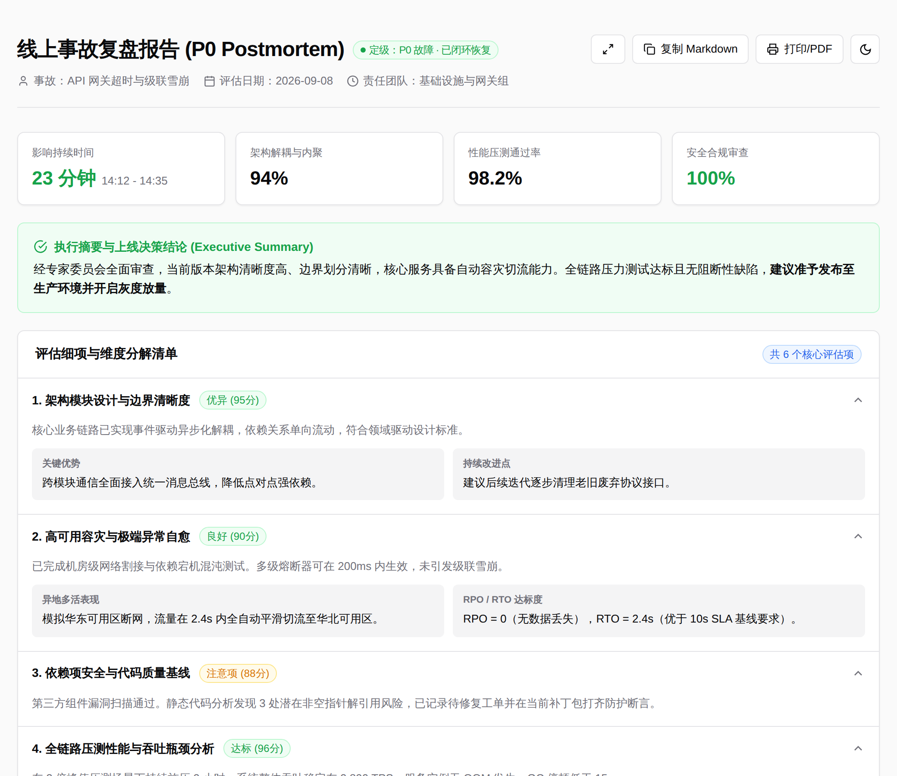
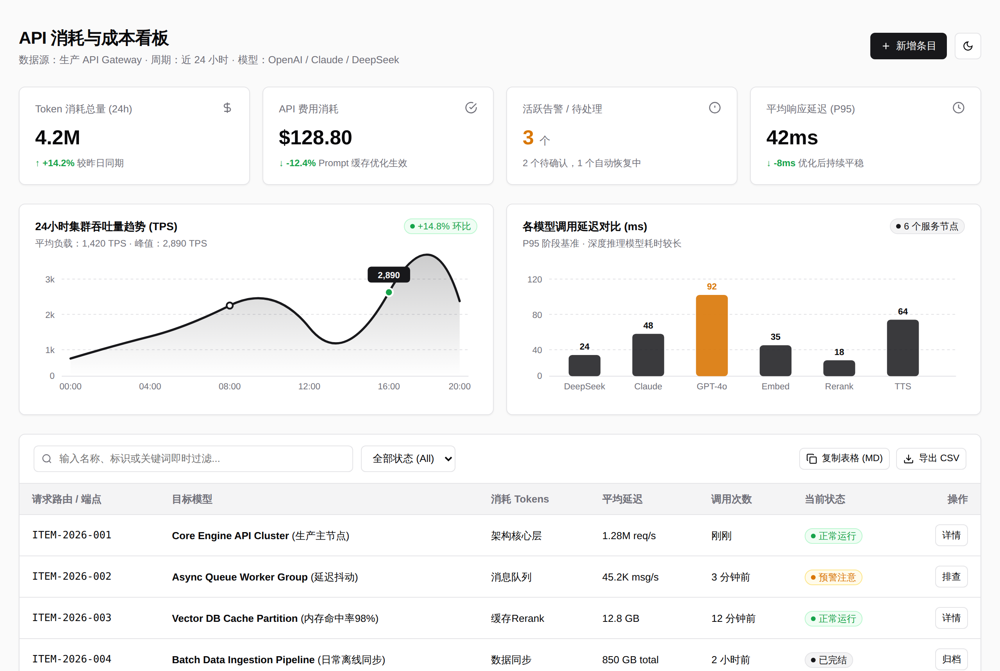
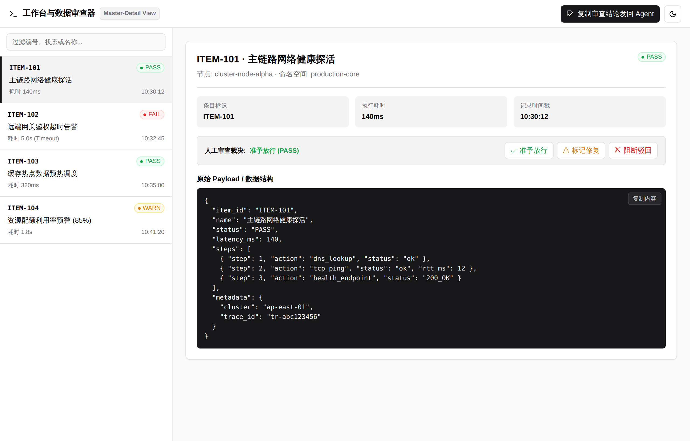
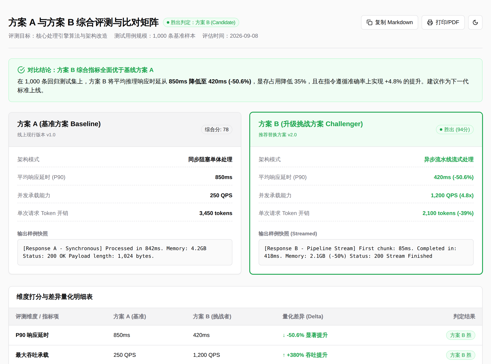
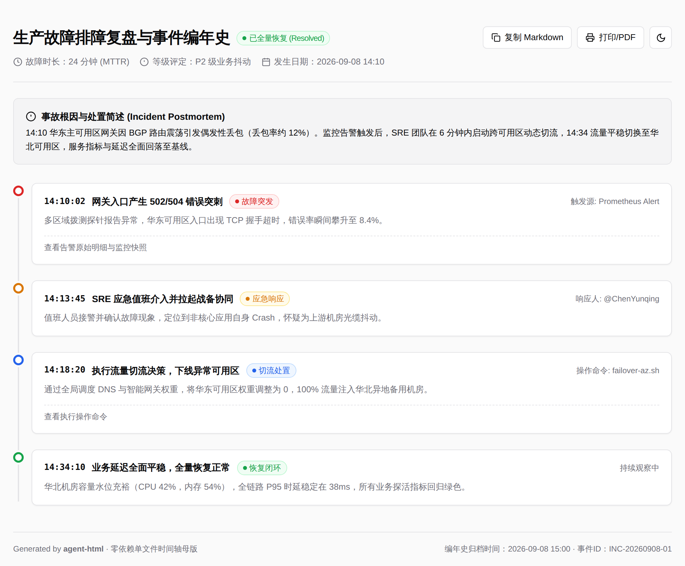
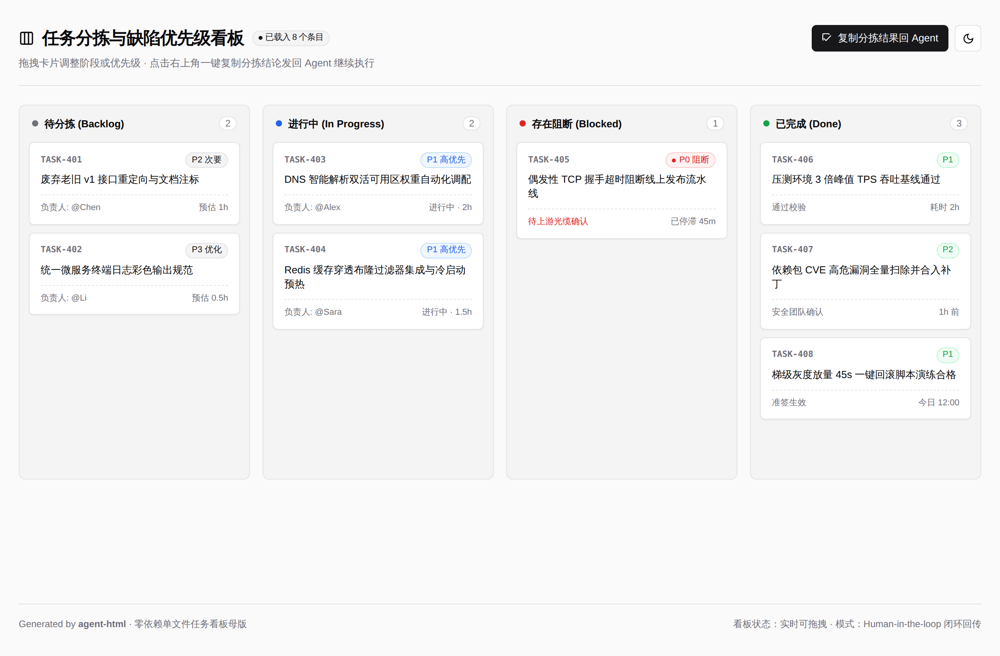

<div align="center">


# agent-html

<p>
  <strong>专为 AI Agent 打造的零依赖单文件 HTML 设计系统与技能</strong><br>
  深度复刻 shadcn/ui 极简中性美学 · 100% 离线自包含 · 0 npm 依赖 · 0 外部 CDN<br>
  专为 Claude Code、Pi、Codex、Cursor 全局适配
</p>

<p>
  <a href="README.md">English</a> ·
  <a href="README.zh-CN.md">简体中文</a>
</p>

<p>
  <a href="https://github.com/QingYunA/agent-html/releases"></a>
  <a href="https://skills.sh"></a>
  
  
  <a href="LICENSE"></a>
  <a href="https://github.com/QingYunA/agent-html/stargazers"></a>
</p>

<p>
  <a href="#快速安装与上手">快速安装</a> ·
  <a href="#解决什么痛点">痛点</a> ·
  <a href="#核心价值">核心价值</a> ·
  <a href="#六大通用布局母版">六大母版</a> ·
  <a href="#提示词触发示例">提示词</a> ·
  <a href="#自验检查器-linter">Linter</a> ·
  <a href="#star-history">Star History</a>
</p>

</div>

---

<p align="center">
  
</p>

---

## 快速安装与上手

### 1. 使用 `skills` 一行命令安装（推荐）

无需手动克隆或配置路径，通过标准 CLI 一键安装至当前项目或全局 70+ 款 Coding Agent：

```bash
# 安装至当前项目工作区（Claude Code, Cursor, Copilot 等）
npx skills add QingYunA/agent-html

# 或全局安装至本机所有 70+ 款 Coding Agent（Claude Code, Pi, Cursor, Codex 等）
npx skills add QingYunA/agent-html -g
```

### 2. 免装即开 CLI 体验

无需安装 Node.js 服务，直接打开画廊或导出生产级母版：

```bash
# 直接在默认浏览器打开组件画廊
npx agent-html open

# 快速导出指定通用母版代码到本地文件
npx agent-html template dashboard > my-dashboard.html
npx agent-html template kanban > my-kanban.html
```

<details>
<summary><strong>手动 Git 软链安装（备选）</strong></summary>

```bash
git clone https://github.com/QingYunA/agent-html.git ~/Code/agent-html

# 链接至统一规范目录
ln -sf ~/Code/agent-html/skills/agent-html ~/.agents/skills/agent-html

# 为 Claude Code 或 Pi 建立感知软链
ln -sf ../../.agents/skills/agent-html ~/.claude/skills/agent-html
ln -sf ../../../.agents/skills/agent-html ~/.pi/agent/skills/agent-html
```
</details>

---

## 解决什么痛点？

让大模型（Claude Code, Pi, Codex, ChatGPT）生成 HTML 报表或看板时，99% 的输出都会掉进两个典型陷阱：

- **CDN 依赖陷阱**：模型习惯注入 `<script src="https://cdn.tailwindcss.com"></script>` 和谷歌字体。初看还行，但只要放到企业内网、隔离机房（Air-gapped）就彻底白屏，初次加载耗时 2 秒并伴随严重的排版闪烁（FOUC），过段时间 CDN 链接失效整个文件就烂掉了。
- **AI 视觉垃圾陷阱**：如果不让它用 CDN，模型就会手写内联 CSS——生成刺眼的纯黑边框、30px 不协调的留白、粗糙的高饱和度色块，且没有任何暗黑模式支持。

`agent-html` 彻底终结了这个两难局面：提炼了一套仅 ~75 行的原生 CSS 变量基座与 4 套经过实战检验的空间布局母版。生成的 HTML 文件双击秒开，自带高级企业级质感。

---

## 核心价值

- **零依赖自包含**：0 个 npm 包、0 行构建脚本、0 个外部 CDN。双击即可在任何离线环境秒开。
- **Zinc 冷灰中性色阶**：精准复刻 shadcn/ui 的设计变量体系。1px 微细边框、精细圆角、高信息密度。
- **六大通用空间布局母版**：收敛长文档报告、宽屏监控大盘、双栏审查工作台、并排对比矩阵、事件时间轴、敏捷任务看板六大泛化骨架。
- **原生明暗双模式**：CSS 变量原生自适应系统偏好，内置 5 行原生 JS 切换开关。
- **闭环反馈设计**：提供“一键导出 Markdown”与“复制审查结论至终端 Agent”机制，拒绝单向死胡同页面。
- **确定性自验检查器（`scripts/validate.mjs`）**：Agent 在将 HTML 呈现给人类前，自动运行检查标签对称性、零 CDN 泄漏与移动端视口配置。
- **24 个内联纯矢量 SVG**：精选 Lucide 风格矢量图标，继承字体颜色，不依赖图标字体库。
- **零 CDN 纯原生图表**：纯 SVG 面积走势图、柱状分布图、复合环形占比图、水平排行榜。

---

## 六大通用布局母版

摆脱具体的业务限制，`agent-html` 将界面提炼为 6 套带有清晰 `<!-- [Slot: ...] -->` 插槽注释的基础空间骨架：

<p align="center">
  
</p>

| 布局母版 | 模板文件路径 | 核心适用场景 | 关键原生特性 |
| :--- | :--- | :--- | :--- |
| **01. 长文档审查报告** | [`templates/zh/report.html`](templates/zh/report.html) | 技术评审、面试评估、RFC 说明书 | 悬浮目录（TOC ScrollSpy）、达标评分卡、可折叠手风琴、打印优化 |
| **02. 监控大盘数据表** | [`templates/zh/dashboard.html`](templates/zh/dashboard.html) | 资源监控、Token 用量、工单大盘 | 4 列 KPI 卡、纯原生 SVG 趋势图/柱状图、实时搜索双重过滤表 |
| **03. 双栏工作台审查器** | [`templates/zh/inspector.html`](templates/zh/inspector.html) | Trace 回溯、JSONL 查看、调试器 | 100vh 满屏、左侧实时检索、右侧动态联动、人工裁决按钮组 |
| **04. 并排横向对比矩阵** | [`templates/zh/compare.html`](templates/zh/compare.html) | 模型 A/B 测、Prompt 改版 diff | 左右双方案并排比对、胜出裁决 Callout、量化 Delta 差异表 |
| **05. 时间轴与故障编年史** | [`templates/zh/timeline.html`](templates/zh/timeline.html) | 突发事故复盘、版本发布路线图 | 单轨垂直时间线、语义状态圆点、诊断日志展开、一键复制 MD |
| **06. 敏捷分拣拖拽看板** | [`templates/zh/kanban.html`](templates/zh/kanban.html) | 需求优先级、Bug 分拣流转 | 纯原生 HTML5 Drag & Drop 跨列拖拽、一键复制看板决策回 Agent |

<details>
<summary><strong>📸 点击展开查看全部 6 大母版高清大图</strong></summary>
<br>

#### 01. 单栏长文档与评估审查报告
<p align="center"></p>

#### 02. 数据大盘与过滤表格
<p align="center"></p>

#### 03. 左右双栏工作台与审查器
<p align="center"></p>

#### 04. 并排横向对比与评测矩阵
<p align="center"></p>

#### 05. 事件时间轴与故障编年史
<p align="center"></p>

#### 06. 任务分拣与敏捷拖拽看板
<p align="center"></p>

</details>

---

## 提示词触发示例

安装完成后，以下日常指令将自动触发 `agent-html` Skill：
- *“帮我做个单文件 HTML 监控看板，展示集群延迟和吞吐量趋势图”*
- *“生成一份技术面试评估报告，单文件 HTML，排版要高级，支持直接打印”*
- *“做一个模型 A 和模型 B 的横向对比矩阵页面”*
- *“不要输出 markdown 墙，把这次架构评审结果做成可视化单文件页面”*

---

## 组件字典与设计规范参考

所有原子 HTML 插槽（按钮、胶囊徽章、Callout 提示条、KPI 统计卡）、24 个 currentColor 矢量 SVG 图标、零 CDN 原生 SVG 图表和微交互脚本，均完整收录在 [skills/agent-html/references/components.md](skills/agent-html/references/components.md) 中，并可在 `index.zh-CN.html` 中实时预览。

---

## 自验检查器 (Linter)

Agent 在将生成的 HTML 交给用户之前，可自检页面规范合规性：

```bash
# 验证单个生成文件
node scripts/validate.mjs path/to/output.html

# 验证所有内置母版
node scripts/validate.mjs --all
```

### 检查规则

- `[ZERO_CDN]`：严禁任何外部 CDN 脚本或远程字体链接泄漏。
- `[THEME_TOKENS]`：必须具备完整的 CSS 变量底座与深浅模式支持。
- `[VIEWPORT]`：必须配置移动端自适应视口标签。
- `[TAG_HYGIENE]`：确保 `<html>`, `<head>`, `<body>` 标签完整对称闭合。
- `[AFFORDANCE]`：非死胡同页面（必须提供导出、复制或打印等操作入口）。
- `[COLOPHON]`：必须包含时间戳生成元数据注释。

---

## 仓库目录结构

```text
agent-html/
├── README.md                      # 英文文档与全景展示
├── README.zh-CN.md                # 简体中文文档
├── index.html                     # 英文介绍主页与组件画廊
├── index.zh-CN.html               # 简体中文介绍主页与组件画廊
├── package.json                   # 项目元数据与脚本配置
├── vercel.json                    # Vercel 静态零配置部署文件 (cleanUrls)
├── bin/
│   └── cli.mjs                    # 零依赖独立命令行工具 (npx agent-html)
├── templates/                     # 独立单文件 HTML 母版
│   ├── en/                        # 🇺🇸 纯英文 6 大通用母版
│   └── zh/                        # 🇨🇳 纯中文 6 大通用母版
├── assets/
│   ├── logo.svg                   # 矢量品牌 Logo (Gemini 官方定制)
│   └── screenshots/
│       ├── en/                    # 🇺🇸 英文专有 2x 视网膜高清截图集
│       └── zh/                    # 🇨🇳 中文专有 2x 视网膜高清截图集
├── scripts/
│   └── validate.mjs               # 零依赖确定性 HTML 检查脚本
└── skills/
    └── agent-html/
        ├── SKILL.md               # 面向 Agent 的中英双语生成准则与插槽规范
        ├── assets/                # 随 Skill 打包分发的母版镜像
        ├── references/
        │   └── components.md      # 原子组件与 24 矢量 SVG 参考字典
        └── evals/
            └── evals.json         # 涵盖全部 6 大母版的基准评测用例集
```

---

## Star History

<p align="center">
  <a href="https://star-history.com/#QingYunA/agent-html&Date">
    
  </a>
</p>

---

## 社区交流

欢迎在 [LINUX DO](https://linux.do) 社区参与交流、反馈建议与分享使用体验。

---

## 开源协议

[MIT License](LICENSE) © 2026 QingYunA

